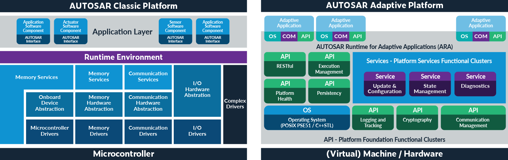

# AUTOSAR

[What is AUTOSAR in details](https://www.parasoft.com/solutions/autosar/)

AUTOSAR stands for AUTomotive Open System ARchitecture. It is a development partnership of automotive interested parties founded in 2003. It pursues the objective of creating and establishing an open and standardized software architecture for automotive electronic control units (ECUs).
Goals include scalability to different vehicle and platform variants, transferability of software, consideration of availability and safety requirements, collaboration between various partners, sustainable use of natural resources, and maintainability during the product lifecycle.

