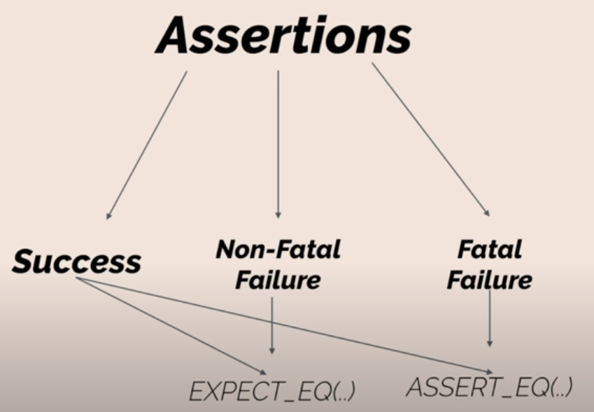
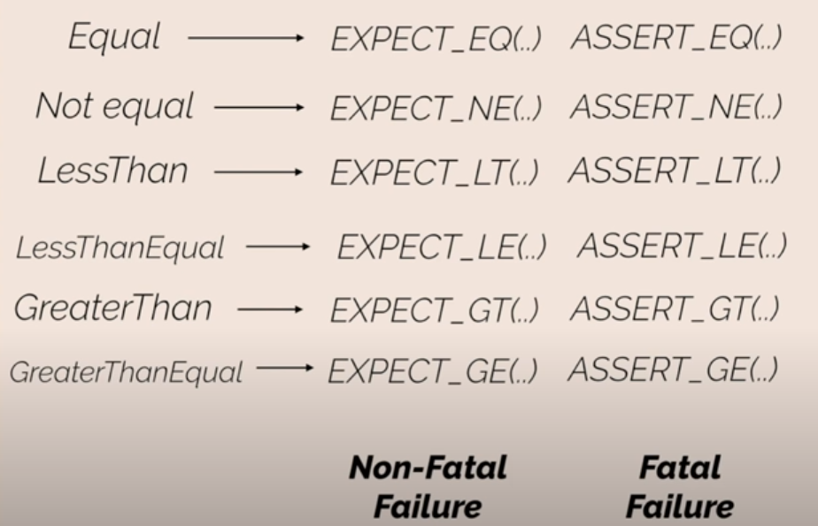

# Tutorial#1, Introduction

## 2 tests with 1 subtest:

```cpp
#include <iostream>
#include <gtest/gtest.h>

TEST( TestName, Subtest_1 )
{
    ASSERT_TRUE(1 == 2 );
}

TEST( TestName2, Subtest_1 )
{
    ASSERT_TRUE( 1 == 1 );
}


int main (int argc, char **argv )
{
    testing::InitGoogleTest(&argc, argv);

    return RUN_ALL_TESTS();
}
```

## Expect vs Assert:



**With expected it will not stop on test failure!!**

```cpp
#include <iostream>
#include <gtest/gtest.h>

TEST( TestName, Subtest_1 )
{
    EXPECT_EQ( 1, 2 );
    std::cout<<"Is it visible?";
}


int main (int argc, char **argv )
{
    testing::InitGoogleTest(&argc, argv);

    return RUN_ALL_TESTS();
}
```

**With assert it will stop on test failure!!**

```cpp
#include <iostream>
#include <gtest/gtest.h>

TEST( TestName, Subtest_1 )
{
    ASSERT_EQ( 1, 2 );
    std::cout<<"Is it visible?";
}


int main (int argc, char **argv )
{
    testing::InitGoogleTest(&argc, argv);

    return RUN_ALL_TESTS();
}
```

## Tutorial#1 summary


