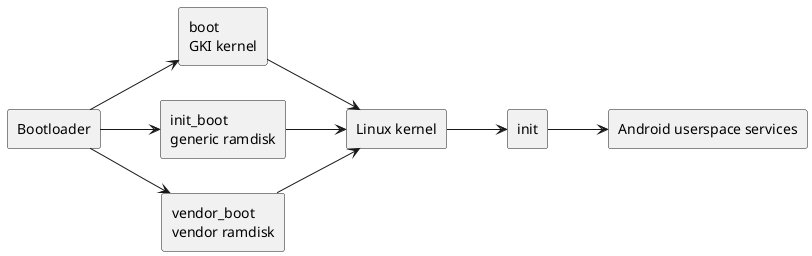

# Core Partitions

## `boot` and `init_boot`

Older Android devices commonly used a monolithic `boot.img` in the `boot`
partition. It bundled the Linux kernel and the ramdisk used to start Android.
This coupled the hardware-specific kernel closely to userspace boot components,
making independent updates more difficult.

On devices launched with Android 13 or later, the boot image format can use a
separate `init_boot` partition. This supports Android's Generic Kernel Image
(GKI) architecture:

| Partition | Typical contents | Responsibility |
| --- | --- | --- |
| `boot` | GKI kernel and boot metadata | Provides the kernel that starts the system. |
| `init_boot` | Generic ramdisk, including the first-stage `init` binary and generic `init.rc` files | Starts the generic Android userspace boot environment. |
| `vendor_boot` | Vendor ramdisk fragments and vendor boot configuration | Supplies device- and SoC-specific boot components. |

`init_boot` is optional from the platform's perspective: the exact partition
layout depends on the Android release, boot-image header version, and device
implementation. It does not eliminate `vendor_boot`; device-specific ramdisk
content remains separate from the generic Android ramdisk.

### Boot flow

1. The bootloader verifies and loads the boot image, then loads the ramdisk
   images required by that device's boot-image layout.
2. The Linux kernel takes control and unpacks or mounts the ramdisk content.
3. The kernel starts the `init` process from the generic ramdisk.
4. `init` reads its configuration, incorporates vendor-specific configuration,
   and starts Android userspace services.

### Why GKI matters

GKI aims to standardize the Android kernel interface so that a common kernel
can be used across compatible devices. Separating generic framework boot
components from vendor-specific components reduces their coupling and enables
independent updates when the device's compatibility requirements are met.

## Further reading

- [AOSP Insider: Boot and init_boot partitions](https://aospinsider.com/courses/aosp-course-1/44-boot-init-boot-partitions/)
- [AOSP: Generic Kernel Image](https://source.android.com/docs/core/architecture/kernel/generic-kernel-image)
- [AOSP: Boot image header](https://source.android.com/docs/core/architecture/bootloader/boot-image-header)
