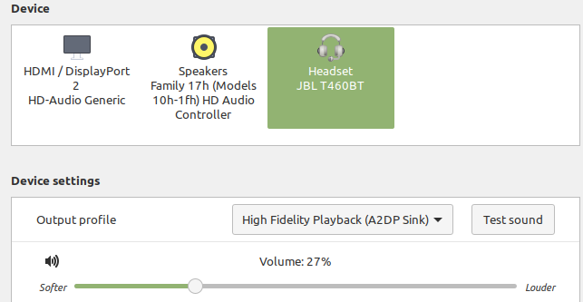
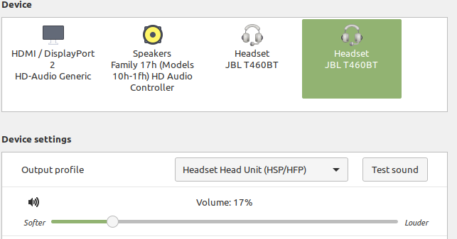

# Pulseaudio

Sometimes due to skype or some apps on linux pulseaudio is crashing and then there is a problem
with connecting a wireless headset. In this case it isn't possible to set an output profile **High Fidelity Playback (A2DP Sink)**.

In sound manager it should be visible like here:



Otherwise when quality is very poor it is set as here:



Problem occurs when it is unable to switch back to **A2DP Sink** and in `dmesg` there are visible errors like here:
```
[21919.890181] Bluetooth: hci0: SCO packet for unknown connection handle 0
[21919.890183] Bluetooth: hci0: SCO packet for unknown connection handle 0
[21919.900028] Bluetooth: hci0: SCO packet for unknown connection handle 0
[21919.900034] Bluetooth: hci0: SCO packet for unknown connection handle 0
[21919.900036] Bluetooth: hci0: SCO packet for unknown connection handle 0
[21919.900037] Bluetooth: hci0: SCO packet for unknown connection handle 0
[21919.900038] Bluetooth: hci0: SCO packet for unknown connection handle 0
[21919.900040] Bluetooth: hci0: SCO packet for unknown connection handle 0
```

To solve this problem you can restart the pulseaudio service.

## Restart pulseaudio

### Check pulseaudio status

```bash
pulseaudio --check
```

It normally prints no output, just an exit code. 0 means running. Mine were not running, so I just advanced to the "Start pulseaudio daemon" step below.

### Kill running pulseaudio daemon

```bash
pulseaudio -k
```

### Start pulseaudio daemon

```bash
pulseaudio -D
```
