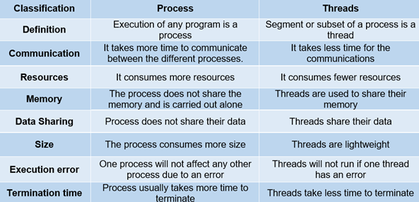

# Process vs thread in Linux

[ByteByteGo Process vs Thread short video](https://www.youtube.com/watch?v=4rLW7zg21gI)

## Process definition

Processes are basically the programs that are dispatched from the ready state and are scheduled in the CPU for execution. PCB (Process Control Block) holds the concept of a process.
A process can create other processes which are known as Child Processes.
The process takes more time to terminate and it is isolated, meaning it does not share memory with any other process.

The process can have the following states:

- new
- ready
- running
- waiting
- terminated
- suspended

## Thread

A thread is a segment of a process, meaning a process can have multiple threads and these multiple threads are contained within a process.

A thread has three states:

- running
- ready
- blocked

## Difference between Process and Thread

