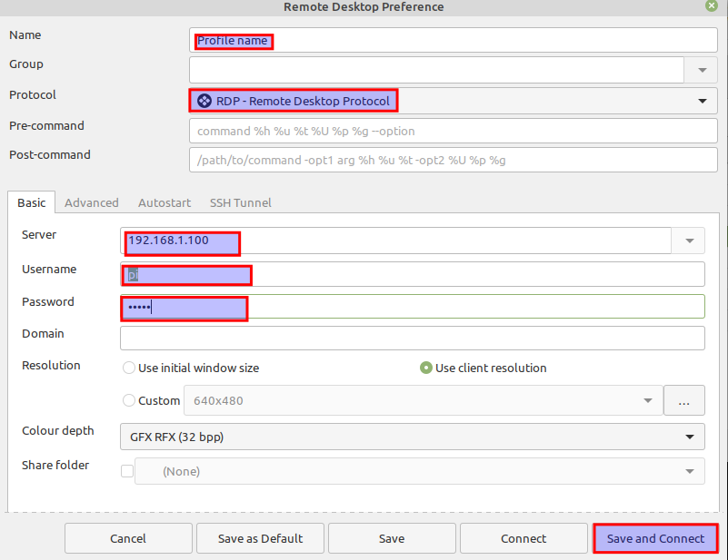

# RDP

Remote Desktop Protocol is a proprietary protocol developed by Microsoft which provides a user with a graphical interface to connect
to another computer over a network connection. It works on Windows, Linux (for example Remmina), Unix, macOS, iOS, Android. By default the server listens on TCP port 3389 and UDP port 3389.

[Wiki](https://en.wikipedia.org/wiki/Remote_Desktop_Protocol)

## RDP server on Linux

[Set RDP tutorial](https://linuxconfig.org/ubuntu-20-04-remote-desktop-access-from-windows-10)

Steps to set Remote Desktop on Ubuntu 20.04:
```bash
# Install xrdp
sudo apt install xrdp
# Enable xrdp after reboot and immediately
sudo systemctl enable --now xrdp
# Open a firewall port
sudo ufw allow from any to any port 3389 proto tcp
```

After that you should be able to connect with this device via RDP.

## RDP client on Linux

To connect to an RDP server you can use the remmina program.

1. Install remmina:
```bash
sudo apt-add-repository ppa:remmina-ppa-team/remmina-next
sudo apt update
sudo apt install remmina remmina-plugin-rdp remmina-plugin-secret
```

2. Click the `+` sign on the top left, which is `New connection profile`
3. Fill all required data like it is on the picture:


