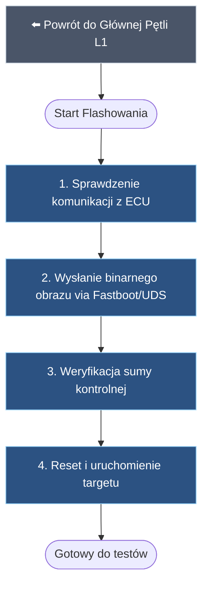

# ⚡ Wnętrze Procesu: Flashowanie (Poziom 2)

Tu dzieje się to, co w głównym grafie było tylko jednym kafelkiem.

```mermaid
flowchart TD
    classDef step fill:#2c5282,stroke:#90cdf4,color:#fff;
    classDef back fill:#4a5568,stroke:#cbd5e0,color:#fff;

    F_Start([Start Flashowania]) --> F_Check[1. Sprawdzenie komunikacji z ECU]:::step
    F_Check --> F_Send[2. Wysłanie binarnego obrazu via Fastboot/UDS]:::step
    F_Send --> F_Verify[3. Weryfikacja sumy kontrolnej]:::step
    F_Verify --> F_Reboot[4. Reset i uruchomienie targetu]:::step
    F_Reboot --> F_Done([Gotowy do testów])

    %% Przycisk powrotu wyżej
    Back[⬅️ Powrót do Głównej Pętli L1]:::back --> F_Start

    click Back "../01_main_loop/" "Wróć poziom wyżej"
```

[⬅️ Wróć do głównej pętli](./01_main_loop.md)