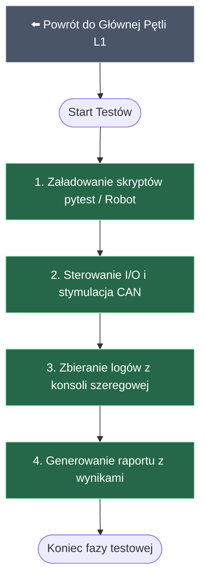

# 🧪 Wnętrze Procesu: Testowanie (Poziom 2)

Szczegółowy przebieg egzekucji testów na stanowisku.

```mermaid
flowchart TD
    classDef step fill:#276749,stroke:#9ae6b4,color:#fff;
    classDef back fill:#4a5568,stroke:#cbd5e0,color:#fff;

    T_Start([Start Testów]) --> T_Load[1. Załadowanie skryptów pytest / Robot]:::step
    T_Load --> T_IO[2. Sterowanie I/O i stymulacja CAN]:::step
    T_IO --> T_Logs[3. Zbieranie logów z konsoli szeregowej]:::step
    T_Logs --> T_Report[4. Generowanie raportu z wynikami]:::step
    T_Report --> T_Done([Koniec fazy testowej])

    %% Przycisk powrotu wyżej
    Back[⬅️ Powrót do Głównej Pętli L1]:::back --> T_Start

    click Back "../01_main_loop/" "Wróć poziom wyżej"
```

[⬅️ Wróć do głównej pętli](./01_main_loop.md)