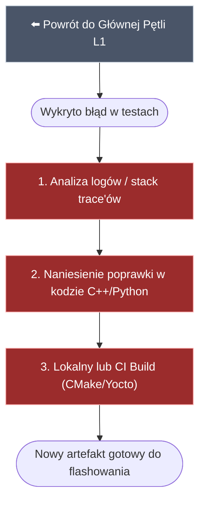

# 🛠️ Wnętrze Procesu: Poprawki Kodu i Budowanie (Poziom 2)

Co się dzieje, gdy testy wykażą błąd i trzeba wracać na początek pętli.

```mermaid
flowchart TD
    classDef step fill:#9b2c2c,stroke:#feb2b2,color:#fff;
    classDef back fill:#4a5568,stroke:#cbd5e0,color:#fff;

    B_Start([Wykryto błąd w testach]) --> B_Analyze[1. Analiza logów / stack trace'ów]:::step
    B_Analyze --> B_Code[2. Naniesienie poprawki w kodzie C++/Python]:::step
    B_Code --> B_Compile["3. Lokalny lub CI Build (CMake/Yocto)"]:::step
    B_Compile --> B_Done([Nowy artefakt gotowy do flashowania])

    %% Przycisk powrotu wyżej
    Back[⬅️ Powrót do Głównej Pętli L1]:::back --> B_Start

    click Back "../01_main_loop/" "Wróć poziom wyżej"
```

[⬅️ Wróć do głównej pętli](./01_main_loop.md)