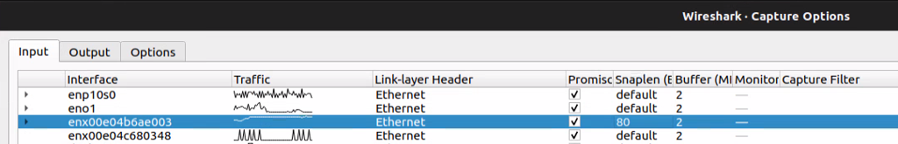
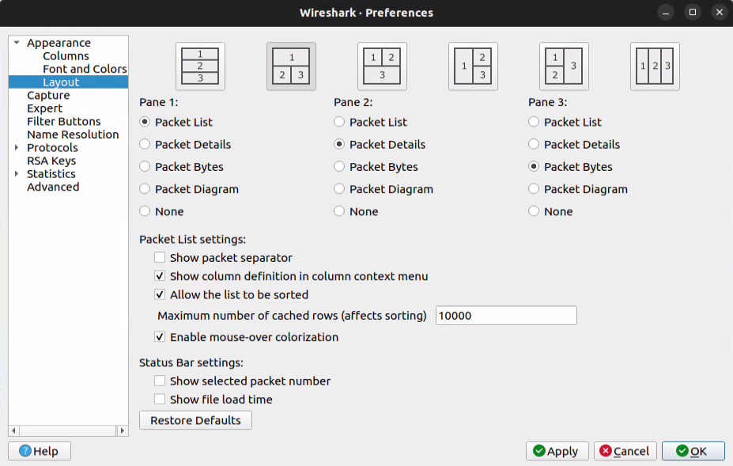
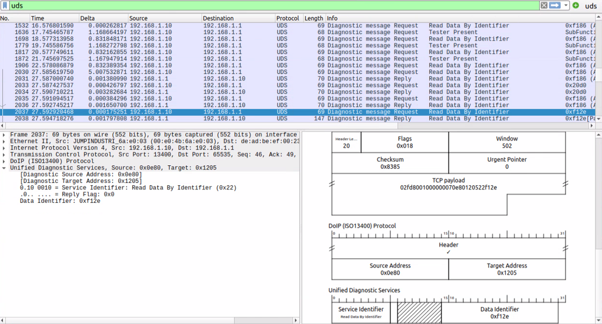
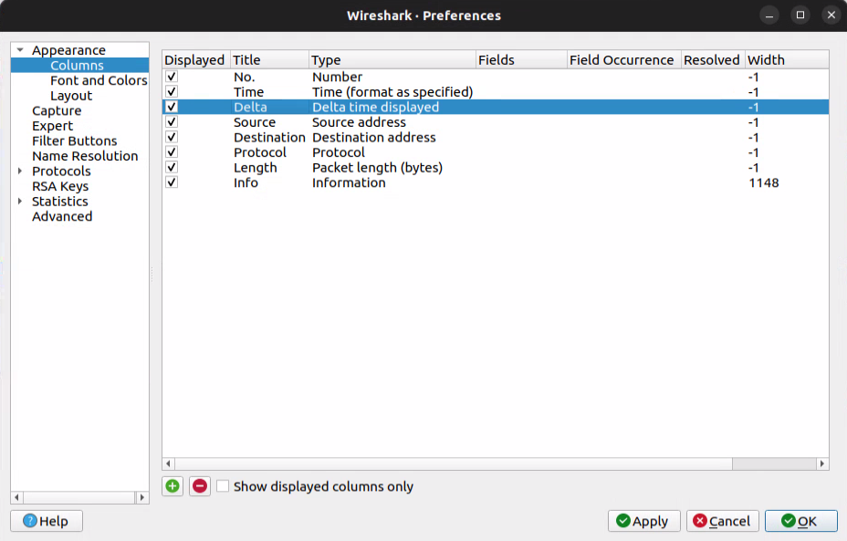

# Wireshark

## Wireshark on a remote PC

See [How to install and use Wireshark on Ubuntu Linux](https://www.geeksforgeeks.org/how-to-install-and-use-wireshark-on-ubuntu-linux/).

### Installing Wireshark on a remote PC

```bash
ssh -X user@ip
sudo add-apt-repository ppa:wireshark-dev/stable
sudo apt update
sudo apt install wireshark
sudo wireshark &
```

### Wireshark capturing too much data (2/5/10 GB) and then crashing?

1. Set a limit for each captured frame (in the case of SWDL, this is the most useful option). Go to Wireshark -> Capture -> Options... -> set 80 in the Snaplen column for your interface (double-click on the interface):



   Cons: frames longer than 80 bytes are flagged as malformed/truncated.

2. Create a capture filter, e.g. to only capture UDS communication. Capture filters don't understand UDS directly, but you can narrow it down to DoIP traffic on port 13400: `port 13400` (not verified).

### Changing the Wireshark layout

Edit -> Preferences -> Appearance -> Layout



For the Packet Diagram pane, it could look like this:



### Adding a column with the delta time between frames

Edit -> Preferences -> Appearance -> Columns -> `+`



### Capturing data from a private interface (vp3) on a remote device (SPA2)

```bash
ssh root@198.19.60.204 "tcpdump -i vp3 -s 0 -w - -n" | wireshark -k -i -
```

`tcpdump` flags:

- `-i vp3` - capture packets from interface `vp3`
- `-s 0` - capture the entire packet; without this, tcpdump truncates packets, which breaks protocol decoding in Wireshark
- `-w -` - write output to stdout
- `-n` - don't resolve names

`wireshark` flags:

- `-k` - start capturing immediately
- `-i -` - read from stdin

### Filtering frames on port 13402 with a non-zero payload

```
tcp.port == 13402 and tcp.len > 0
```
