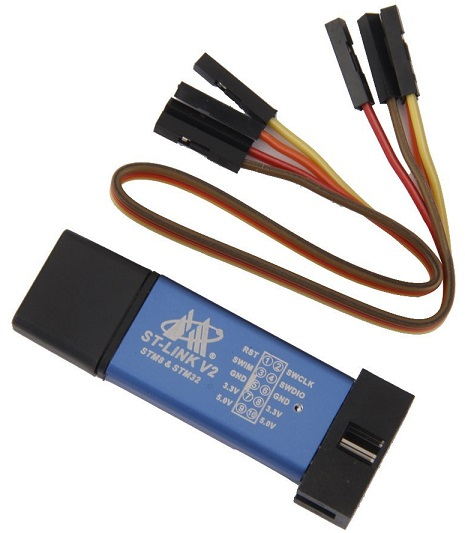
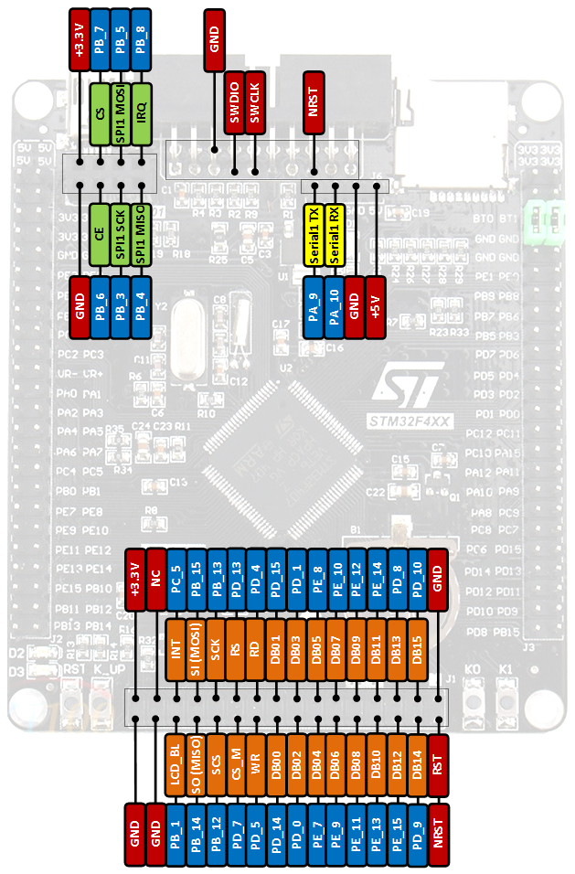

# ST-LINK

## How to Connect ST-LINK V2 to STM32F407VET6 (Black Board)

[Board STM32F407VET6 pinout](https://os.mbed.com/users/hudakz/code/STM32F407VET6_Hello/shortlog/)

1. Connect SWCLK, SWDIO, GND and 3.3V (2, 4, 6, 8) jumpers to ST-LINK.
2. Connect it with SWDIO, SWCLK, GND and 3.3V (on the top right) on the STM32 board.
3. On the STM32F407VET6 board, connect BT0 and BT1 to GND (use jumpers).
4. Flash with the ST-LINK utility.
